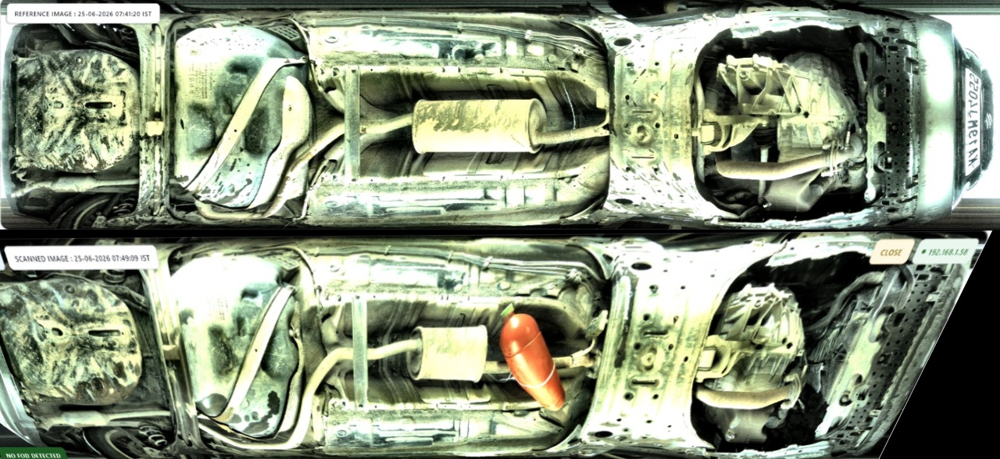
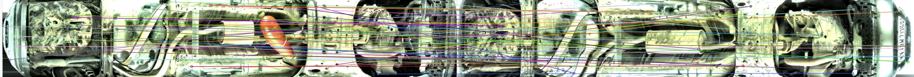
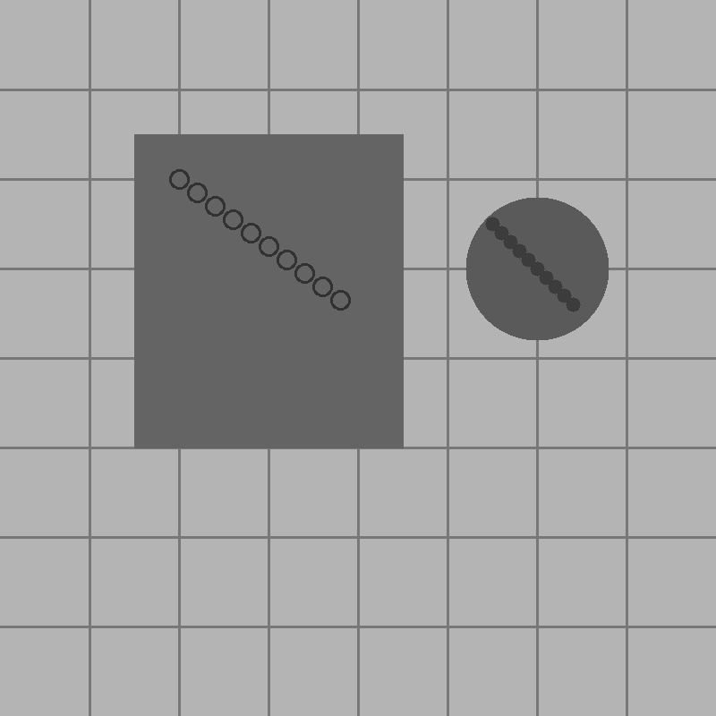
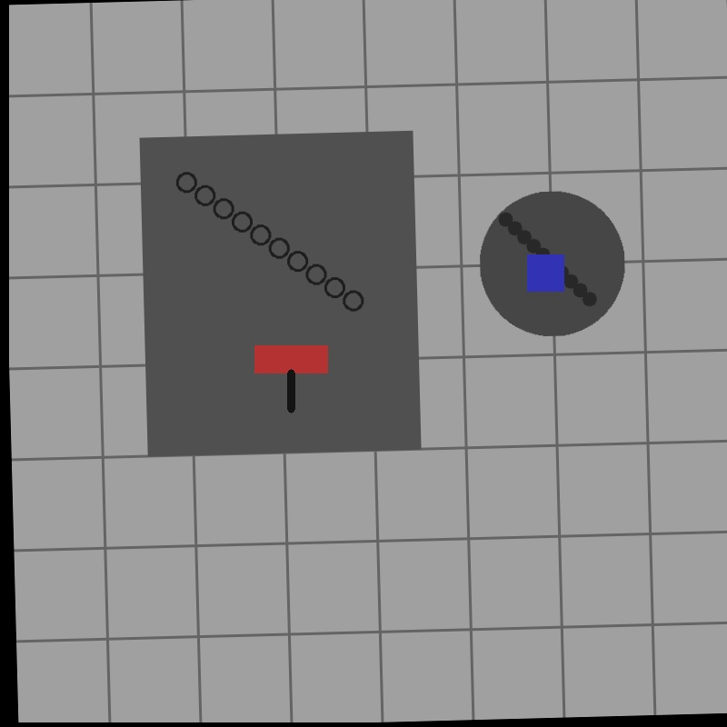

# Industrial Foreign Object Detection (FOD) API



A production-grade, fully offline, hybrid Foreign Object Detection (FOD) API designed to compare one or more OK reference images against a live/inspection image to isolate new foreign objects (such as tools, bolts, debris, or materials).

The system targets near 100% accuracy using a **hybrid validation pipeline** combining classical difference maps, feature-matching spatial alignment, geometric rule-based filters, and pre-trained deep learning classifiers.

---

## System Architecture & Pipeline

The inspection engine operates in 8 sequential phases:

```
1. Image Input ──> 2. Preprocessing ──> 3. Feature Alignment ──> 4. Difference Engine
   (Ref + Current)    (CLAHE + Denoise)   (SIFT + RANSAC Warp)    (SSIM + LAB + Edge)
                                                                           │
                                                                           v
8. JSON Output <── 7. DL Validation <── 6. Proposal Merge <── 5. Threshold & Morph
   (Heatmaps/Masks)   (Deep Features)       (Bounding Boxes)    (Otsu + Open/Close)
```

1. **Image Preprocessing**: Crops the inspection window, standardizes resolutions (default `1024x1024`), filters sensor noise using an edge-preserving bilateral filter, and normalizes illumination via **CLAHE** in the LAB Lightness channel.
2. **Keypoint Alignment**: Performs feature detection (SIFT, ORB, or AKAZE) and matches keypoints to warp the inspection image onto the reference's coordinate plane. Computes an alignment quality metric. If camera movement is too extreme, it returns `ALIGNMENT_FAILED`.
   <br><br>
   
3. **Multi-Reference Matching**: If multiple OK reference images are loaded, the system attempts alignment against all references and selects the best-matching reference (highest combined alignment + SSIM score) before run analysis.
4. **Weighted Difference Engine**: Computes grayscale SSIM structure difference, absolute difference, perceptual Delta-E color distance in LAB, and Sobel edge variance. Blends them into a single difference heatmap.
5. **Thresholding & Morphology**: Employs Otsu, Adaptive Gaussian, or Static thresholding. Applies morphological opening (to eliminate camera grain) and closing (to patch fragmented edges). Fills contours to create a binary mask.
6. **Region Proposal**: Extracts connected components, filters out objects that violate area, solidity, circularity, or aspect ratio constraints, and merges close/overlapping bounding boxes.
7. **Deep Learning Validation**: Crops candidate regions and runs a pre-trained CNN (MobileNetV3 or ResNet18) to extract deep semantic features. Compares reference and inspection patches using Cosine Similarity. If similarity is very high, it rejects the region as a shadow, reflection, or minor surface glare.
8. **Ignore Mask Support**: Dynamically intersects remaining candidates with a user-supplied binary ignore mask, filtering out anomalies in designated areas (e.g. text labels, background parts).

---

## Project Directory Structure

```
fod_api/
│
├── app.py                 # FastAPI Application (Router and UI server)
├── config.py              # Configuration schemas and parameters tuning
├── detector.py            # Main FOD Pipeline Orchestrator
├── alignment.py           # SIFT/ORB feature matching & image warping
├── preprocessing.py       # Bilateral filtering, CLAHE, and resizing
├── difference.py          # SSIM, LAB color distance, Sobel, Otsu
├── segmentation.py        # Contour extraction and bounding box merging
├── validation.py          # Deep feature similarity & ignore masks
├── utils.py               # Image writing, heatmaps, logging helpers
├── test_api.py            # Programmatic synthetic test suite
├── standalone_full_inference.py # Single-file standalone inference script
│
├── static/                # Web Dashboard assets
│   ├── index.html
│   ├── style.css
│   └── script.js
│
├── uploads/               # Holds uploaded files for auditing (Auto-generated)
├── output/                # Serves marked images, heatmaps, and masks (Auto-generated)
├── models/                # Local cache for PyTorch model weights (Auto-generated)
│
├── requirements.txt       # Python package dependencies
├── Dockerfile             # Containerized deployment settings
└── README.md              # Technical manual
```

---

## Quick Start Guide

### 1. Installation

Python 3.12+ is recommended. Set up a virtual environment and install dependencies:

```bash
# Clone or navigate to the directory
cd fod_api

# Create virtual environment
python -m venv .venv

# Activate (Windows)
.venv\Scripts\activate

# Activate (Linux/macOS)
source .venv/bin/activate

# Install dependencies (CPU-optimized PyTorch wheel index included)
pip install -r requirements.txt --extra-index-url https://download.pytorch.org/whl/cpu
```

### 2. Run Automated Integration Test

To verify code sanity and generate sample test files, execute the test script:

```bash
python test_api.py
```
This generates three synthetic test images in the root directory:
- `test_ref.jpg` (OK Reference image)
- `test_curr.jpg` (Live image with camera rotation, shift, light shift, and added objects)
- `test_mask.jpg` (Ignore mask covering one of the added objects)

**Example Test Images generated by script:**



### 3. Start the API Server

```bash
python app.py
```
The application will start at `http://localhost:8000/`.

---

## Standalone Inference Script

For environments where deploying the full API server is not necessary or feasible, the project includes `standalone_full_inference.py`. 

This script consolidates the entire FOD pipeline (preprocessing, alignment, difference engine, segmentation, and validation components) into a single, dependency-free Python file (aside from standard PyPI packages like OpenCV, PyTorch, and Ultralytics). It is ideal for edge devices, embedded systems, or quick command-line testing without needing to set up the FastAPI server infrastructure.

---

## API Documentation

### POST `/detect-fod`

Performs foreign object detection. Accepts multipart form data.

#### Parameters:
- `reference_images` (File, Required): One or more OK reference images.
- `current_image` (File, Required): The live inspection image.
- `ignore_mask` (File, Optional): Binary ignore mask image (Black `0` = Ignore, White `255` = Inspect).
- `min_area` (Form Integer, Optional): Minimum pixel size of valid objects (overrides config).
- `threshold_method` (Form String, Optional): `OTSU`, `ADAPTIVE`, or `STATIC`.
- `enable_dl_validation` (Form Boolean, Optional): Enables/Disables deep feature shadow checking.
- `deep_feature_threshold` (Form Float, Optional): Cosine similarity threshold for rejection.

#### Sample Curl Request:
```bash
curl -X POST "http://localhost:8000/detect-fod" \
  -F "reference_images=@test_ref.jpg" \
  -F "current_image=@test_curr.jpg" \
  -F "ignore_mask=@test_mask.jpg" \
  -F "min_area=150" \
  -F "enable_dl_validation=true"
```

#### Sample Response JSON (FOD Detected):
```json
{
  "status": "FOD_DETECTED",
  "accuracy_mode": "HYBRID",
  "similarity_score": 91.21,
  "alignment_score": 0.643,
  "objects": 1,
  "detections": [
    {
      "x": 386,
      "y": 521,
      "width": 20,
      "height": 69,
      "area": 1111,
      "confidence": 0.94,
      "label": "foreign_object"
    }
  ],
  "output_image": "output/test_curr_168873041_marked.jpg",
  "difference_map": "output/test_curr_168873041_diff.jpg",
  "mask_image": "output/test_curr_168873041_mask.png",
  "processing_time_ms": 1484
}
```

---

## Testing Web Dashboard

Navigate to `http://localhost:8000/` in your browser. 

1. **Upload Images**: Drag-and-drop the generated `test_ref.jpg`, `test_curr.jpg`, and `test_mask.jpg` into their respective slots.
2. **Parameters Panel**: Adjust parameters in real-time on the sidebar panel.
3. **Run**: Click **RUN INSPECTION** to trigger the pipeline.
4. **Visualizer**: See the side-by-side marked result, difference heatmap, and binary mask. Click the zoom icon on any image to open it in full size.

---

## Tuning for Maximum Accuracy

| Scenario / Issue | Root Cause | Tuning Strategy |
|---|---|---|
| **False Positives on Shadows / Lighting** | Sun/Light shifts create intense edges | 1. Enable DL Validation. <br>2. Increase `deep_feature_threshold` (e.g. `0.88 - 0.90`). <br>3. Increase `weight_ssim` and decrease `weight_abs_diff`. |
| **False Positives on Small Screws / Dirt** | Minor background fluctuations | 1. Increase `min_area` parameter (e.g. `100 - 300`). <br>2. Set morphology `open_iterations` to `2`. <br>3. Increase `min_solidity` to reject sparse dust blobs. |
| **Alignment Failures** | Camera vibration or position change | 1. Switch alignment method to `SIFT` for higher accuracy. <br>2. Lower `min_align_score` to `0.30` if cameras are consistently offset. |
| **Missing Low-Contrast Objects** | Target object color matches background | 1. Increase `weight_edge_diff` or `weight_ssim`. <br>2. Switch `threshold_method` to `ADAPTIVE` to capture local contours. |

---

## Adding Ignore Zones
If you have static background elements, moving vehicle parts (e.g., windshield wipers), or text areas that regularly change, create an **Ignore Mask**:
1. Save a canvas with identical dimensions to your reference image.
2. Paint the inspection areas in **solid white** (`#FFFFFF` or `255`).
3. Paint the ignore zones in **solid black** (`#000000` or `0`).
4. Upload this file as `ignore_mask` in your API request or Web UI. Any candidate object intersecting the black zone by more than 15% will be automatically discarded.

---

## Multi-Reference Support
When inspecting vehicles on an assembly line, small shifts in chassis models can occur. The system supports uploading multiple reference images. 
- In your API request, attach multiple files to the `reference_images` key.
- The pipeline automatically computes the alignment matrix for each reference.
- It chooses the reference image that gives the highest combined Homography inlier count and SSIM similarity, ensuring the comparison is made against the absolute closest match.

---

## Docker Deployment (Production-Ready)

Build and run the containerized API locally:

```bash
# Build the container
docker build -t fod-api .

# Run the container (Map to port 8000)
docker run -d -p 8000:8000 --name fod-engine fod-api
```
The Docker image pre-downloads all model weights during building, making it **100% offline-ready** at launch without any runtime internet requirements.
